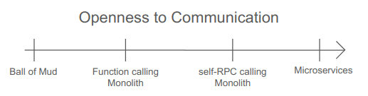

# Modular Monolith Fast API

This is a modular monolith Fast API project that uses the latest and greatest tooling ([uv](https://github.com/astral-sh/uv), [ruff](https://github.com/astral-sh/ruff), [pyright](https://github.com/microsoft/pyright), [pydantic](https://github.com/pydantic/pydantic), [pytest](https://github.com/pytest-dev/pytest), [fastapi](https://github.com/fastapi/fastapi), [sqlmodel](https://github.com/fastapi/sqlmodel), etc) attempting to implement a modular monolith architecture. The repository include pre-commit hooks for ruff, pyright, and uv.

For quick setup instructions, jump to the [Setup and development](#setup-and-development) section.
This project serves as a proof of concept and starting point for building modular monolith applications with FastAPI.
For technical details, see [Choosing technology](#project-implementation)

## Architecture and Design

### What's a modular monolith anyway?

[</img>](https://apilama.com/2018/07/18/scalability-design-with-microservices/)
[</img>](https://foojay.io/today/microservices-design-principles-for-well-crafted-architecture/)

[I don't understand the point of modular monolithic](https://www.reddit.com/r/softwarearchitecture/comments/1g4gb9a/i_dont_understand_the_point_of_modular_monolithic/), me neither.. a monolith? modules? big ball of mud? actually I never heard of the term "modular monolith" until I started working on this project so i searched around.
There is certinly some hype around the idea of modular monoliths, there are framewworks like [Lato a Python microframework designed for building modular monoliths and loosely coupled applications.](https://github.com/pgorecki/lato) or [Actio ... enables you to effortlessly switch between monolithic and microservices architectures.](https://github.com/crufters/actio) but that doesn't tell me what a modular monolith is!

I collected a few articles trying to explain what a modular monolith, some in support of the idea and some say it doesn't exist whatsoever. Baffling.

[What is a modular monolith?](https://maddevs.io/glossary/modular-monolith/) |
[Actually Talking about Modular Monoliths](https://jeremydmiller.com/2024/04/08/actually-talking-about-modular-monoliths/) |
[The Mythical Modular Monolith](https://jakubpierzchlewicz.medium.com/the-mythical-modular-monolith-ec2375222162) |
[Long live the Monolith! Monolithic Architecture != Big Ball of Mud](https://codeopinion.com/long-live-the-monolith-monolithic-architecture-big-ball-of-mud/) |
[Modular Monoliths • Simon Brown • GOTO 2018](https://www.youtube.com/watch?v=5OjqD-ow8GE) |
[Microservices vs Monolithic Architecture](https://www.youtube.com/watch?v=6-Wu178sOEE) |
[Cross module communication in modular monolith](https://stackoverflow.com/a/72667931/12603110) |
[What Is a Modular Monolith?](https://www.geeksforgeeks.org/what-is-a-modular-monolith/) |
[Structuring Modular Monoliths](https://dev.to/xoubaman/modular-monolith-3fg1) |
[Modular Monolith: A Primer](https://www.kamilgrzybek.com/blog/posts/modular-monolith-primer) |
[Modular Monolith: Is This the Trend in Software Architecture?](https://arxiv.org/abs/2401.11867) |
[Microservices Killer: Modular Monolithic Architecture](https://medium.com/design-microservices-architecture-with-patterns/microservices-killer-modular-monolithic-architecture-ac83814f6862) |
[Modular monolith in Python](https://breadcrumbscollector.tech/modular-monolith-in-python/) |
[Modular Monoliths: Revolutionizing Software Architecture for Efficient Payment Systems in Fintech](https://www.researchgate.net/publication/374870402_Modular_Monoliths_Revolutionizing_Software_Architecture_for_Efficient_Payment_Systems_in_Fintech) |
[How modular can your monolith go? Part 7 - no such thing as a modular monolith?](https://microservices.io/post/architecture/2024/05/13/how-modular-can-your-monolith-go-part-7-no-such-thing-as-a-modular-monolith.html)

I think these two fellows in the comments summarize the concensous best:

[Don't start with microservices – monoliths are your friend](https://news.ycombinator.com/item?id=29576352)

> no one ever talks about architectures in the middle between those two - modular monoliths
> (KronisLV)  
> Because there is no newly invented architecture called "modular monolith" - monolith was always supposed to be MODULAR from the start.
> (ozim)

So... if you read between the lines modular monoliths are just a buzzword for "good software engineering practices"?

#### What does the modular monolith solve?

If we think about [Microservices Communications](https://medium.com/design-microservices-architecture-with-patterns/microservices-communications-f319f8d76b71), the main difference between microservices and modular monoliths is that "One runs on a single process and the other runs on multiple processes". They both apply "Separation of Concerns" and "Single Responsibility" principles, just at different abstraction levels.

The true argument for and against mono-centric vs distributed concern management is [`Conway's Law`](https://www.youtube.com/watch?v=TqhkWaeUN_8), which states that "organizations design systems that mirror their communication structure". So the choice between monolith and microservices often comes down to team structure - small teams benefit from monoliths, while multiple teams might prefer microservices.

### Communication between Software Components

[</img>](https://foojay.io/today/microservices-design-principles-for-well-crafted-architecture/)  

The 2x2 grid above, commonly found in articles about microservices versus modular monoliths, splits software architecture into two axes:
- **Logical**: How the software is organized and separated
- **Physical**: Where the software runs

Most GitHub projects claiming to implement modular monoliths actually implement a normal monolith with good separation of concerns. All parts of the software must communicate, typically in one of two ways:

1. **Function Calls** (Local Procedure Calls): Direct function calls between different parts of the software
2. **RPC** (Remote Procedure Calls): Function calls that can work across different machines

If we assume our software is "well-designed" and "modular", we're really only working with the physical axis - determining where the software runs, not how it communicates internally.

The 2x2 grid could be simplified to a single line representing "openness to communication":



A practical example of this is creating a "self-RPC" calling monolith - a REST API application with multiple responsibilities that communicate only through their public API endpoints.

### Project Implementation

After researching modular monoliths, I decided to implement a practical example that demonstrates these concepts. This project implements a pet adoption system that showcases how to build a well-structured modular application. Here are the requirements that guided the implementation:

#### Core Requirements

* **FastAPI and Uvicorn**: The application must be built using FastAPI framework and served with Uvicorn
* **REST API**: Expose a clean, RESTful API interface
* **Multiple Services**: Support multiple responsibilities through different endpoints
* **Internal Communication**: Services must communicate through their public REST API endpoints
* **Logging**: Implement a robust logging system for debugging and monitoring
* **Testing**: Comprehensive test coverage for routes, services, and custom functionality

#### Additional Features

* **Service Separation**: Although monolithic, the application should be designed to be easily split into microservices
* **API Documentation**: Well-defined and typed API with automatic documentation
* **Code Generation**: Auto-generated API clients from service specifications using Pydantic models
* **Modern Async**: Leverage FastAPI and AsyncIO for efficient asynchronous operations
* **Isolated Logging**: Each service maintains its own logging configuration

The following sections detail how these requirements were implemented, starting with the technical choices and architecture decisions.

#### Generating OpenAPI API bindings for Python's AsyncIO

The FastAPI docs demonstrates how to [generate OpenAPI API bindings for TypeScript](https://fastapi.tiangolo.com/advanced/generate-clients/#generate-a-typescript-client) and suggests using [OpenAPI Generator](https://openapi-generator.tech/) to generate bindings for other languages. the OpenAPI generator is an nodejs tool and not a python tool so using it breaks our pure python dependency we have had so far.
There are multiple other tools that can generate python bindings for OpenAPI specifications but they are all either abandoned, unmaintained or not working. they may work for you, I couldn't get any of them to work for this project.  
[Openapi Python Generator](https://github.com/MarcoMuellner/openapi-python-generator) |
[openapi-python-client](https://github.com/openapi-generators/openapi-python-client) |
[fastapi-code-generator](https://github.com/koxudaxi/fastapi-code-generator) |
[pythogen](https://github.com/artsmolin/pythogen)

##### OpenAPI Generator

OpenAPI Generator offers a variety of customization options, the [customization documentation](https://github.com/OpenAPITools/openapi-generator/blob/master/docs/customization.md) is really long and doesn't mention python at all so I skipped it, here is the command to generate the API:

```bash
npx -g openapi-generator-cli generate -g python --library asyncio \
 -i generated/openapi.json -o generated/api
```

see the [`generate`](https://openapi-generator.tech/docs/usage#generate) command for the cli options and the [`python generator`](https://openapi-generator.tech/docs/generators/python#config-options) for python specific options.
you can also use `--additional-properties` for more python specific options.  
**NOTE:** the `--library asyncio` is a required option in order to be able to self-call the API from within the application. by default the generator uses `urllib3` which is blocking and halts the program making it never respond to the request it has generated to itself. (ask me how I know)

##### [OpenAPI Specification](https://spec.openapis.org/oas/v3.1.0.html#fixed-fields)

how do we generate the OpenAPI specification? FastAPI offers a [Swagger UI](https://fastapi.tiangolo.com/tutorial/metadata/#swagger-ui) and [ReDoc](https://fastapi.tiangolo.com/tutorial/metadata/#redoc) which themselfs are generated from the OpenAPI specification.
FastAPI exposes an `get_openapi` function call that returns the Application OpenAPI specification as a python dictionary. [so it's easy to manipulate and save to a file.](https://fastapi.tiangolo.com/how-to/extending-openapi/) in this project it is done using a script [src/app/subapp.openapi.py](src/app/subapp.openapi.py) called by [run.sh](run.sh) before the application starts. the script scans for all the routes exposed by the application including mounts and subapps (which aren't "visible" to the parent application object) to merges them into a single OpenAPI specification.

### Mounts🐎 vs Routers⤵️

When diving into the FastAPI documentation ([Bigger Applications - Multiple Files](https://fastapi.tiangolo.com/tutorial/bigger-applications/)) you're introduced to the concept of routers as a way to organize your application routes as inticing as it is to implement into modular monolith architecture we will not be using routers for the services. FastAPI routers are very assessible are intended to to allow easier mangament of the application routes throughout the source code.
Instead we will be using [Sub Applications - Mounts](https://fastapi.tiangolo.com/advanced/sub-applications/).
the [Purpose of sub applications](https://www.reddit.com/r/FastAPI/comments/11yz0pn/comment/jdbnxui/?context=3&share_id=SwQyMo9MjF648NPkrI8C5&utm_medium=ios_app&utm_name=ioscss&utm_source=share&utm_term=1) aka Mounts is to create a complete new FastAPI application under the existing one that is invisible to its parent almost completely. it's as if we are executing two separate applications.

**Alternatives:** we don't have to use mounts, we could just run multiple application instances under the same python process. uvicorn exposes [`serve`](https://gist.github.com/tenuki/ff67f87cba5c4c04fd08d9c800437477?permalink_comment_id=4236491#gistcomment-4236491) which can be used to orchestrate multiple applications under the same python process, this however forces us to use different ports for each application! this may be desirable and puts us even closer to the microservice architecture.
**Bonus point to the alternative:** by manutally creating the AsyncIO event loop we can mirror javascript promises and make asyncio act like promises when used with `asyncio.create_task` [How can I start a Python async coroutine eagerly?](https://stackoverflow.com/a/77268945/12603110)

we could go even further and implement [Domain-driven design with Python and FastAPI](https://www.actidoo.com/en/blog/python-fastapi-domain-driven-design) which goes as far as to force "restriction of import between domains" is a little bit of a stretch, stopping here is a good compromise.

### Context aware logger

This project has multiple services and all of them are in the same codebase, they could reference and reuse the same routers extending their own functionality with generic functionality or even call common functions.
This complexity grows fast and keeping track of which and what executes where can become a nightmare fast. only if there was a way to know which service is executing at any given time!  

What is a middleware? from [FastAPI docs - Middleware](https://fastapi.tiangolo.com/tutorial/middleware/):

```
A "middleware" is a function that works with every request before it is processed by any specific path operation. And also with every response before returning it.
```

a middleware is a wrapper around the request and response and it can do whatever it wants with them before they are processed by the path operation.
We can take advantage of this and the fact we use subapps to create a context aware logger! all that's needed is to create a middleware that will set a [context variable](https://docs.python.org/3/library/contextvars.html#asyncio-support) with the name of the current service. see [`LoggerContextMiddleware`](src/common/logging/middleware/logger_context_middleware.py) and [`getContextualLogger`](src/common/logging/getLogger.py) by applying the middleware to the application with a unique name for each service and getting a contextual logger every time we need to log something we are done! no more confusion about which service is logging what!

### What's asynchronous logging anyway?

This great article explains how to go about logging from asyncio without blocking sepecifically [Practice #04. Log From Asyncio Without Blocking](https://superfastpython.com/asyncio-logging-best-practices/) it is suggests to use the [`logging.handlers.QueueHandler`](https://docs.python.org/3/library/logging.handlers.html#logging.handlers.QueueHandler) and [`logging.handlers.QueueListener`](https://docs.python.org/3/library/logging.handlers.html#queuelistener) to achieve this. which essentially queue away the logging messages and process them in a separate thread. this method is easy to implement using only a configuration file and no new code.  
That's all well and good but it doesn't have the word *`async`* in it WHERE IS THE FUN IN THAT? That's a significant inspiration for implementing the [AsyncEmitLogHandler](src/common/logging/AsyncEmitLogHandler.py) which is a logging handler that emits log records as async tasks instead of "running a thread" (it's essentialy the same thing under the `GIL` model) both methodologies operate in a concurrent manner.

following [mCoding's video](https://youtu.be/9L77QExPmI0?si=qy7VcJ0aciWt2D7X&t=128) and partially using his [configuration file](https://github.com/mCodingLLC/VideosSampleCode/blob/master/videos/135_modern_logging/logging_configs/5-queued-stderr-json-file.yaml) the [log_config.json](log_config.json) is a configuration file for the logging system that uses the `AsyncEmitLogHandler` to emit log records as async tasks in both simple plain text and json formats while also keeping the colored uvicorn text output in the console, (see also: [uvicorn logger definition](https://github.com/encode/uvicorn/blob/7983c1ae9c2276b94cd85217f7aa58bb248847c4/uvicorn/config.py#L93))  
**NOTE:** for formatting options and properties of loggers see [LogRecord attributes](https://docs.python.org/3/library/logging.html#logrecord-attributes)
logging formatters [LogRecord attributes](https://docs.python.org/3/library/logging.html#logrecord-attributes)

### Model💃, Relationships💏 and CRUD Operations

This project implements a pet adoption system with two main services:

1. User Service [`src/services/user_service`](src/services/user_service)
2. Pet Service [`src/services/pet_service`](src/services/pet_service)

These services demonstrate a many-to-many relationship where users can adopt multiple pets, and pets can be adopted by multiple users. The services are configured through [config.yaml](config.yaml) and combined into a single application via [src/app/main.py](src/app/main.py).

#### Service Architecture

* **Pet Service**: Manages pet-related operations (create, read, update, delete)
  * Pet attributes: name, species, age, mood, feeding time, interaction time
  * Standalone service that doesn't know about users
  * Provides endpoints for basic pet management and interactions (like feeding)

* **User Service**: Handles user operations and pet adoption
  * User attributes: name, ID
  * Maintains relationships between users and their adopted pets
  * Communicates with the Pet Service through its public API
  * Does not duplicate pet data, only stores relationships

Both services use [SQLModel](https://sqlmodel.tiangolo.com/) for database operations, combining SQLAlchemy's power with Pydantic's data validation. Data is stored in a SQLite database that persists between application restarts.

#### Example Operations

1. **Adopting a Pet**

```bash
# User 1 adopts Pet 1
curl -X 'POST' \
  'http://127.0.0.1:8000/user/users/1/pets/1' \
  -H 'accept: application/json' \
  -d ''
```

Response shows the user with their newly adopted pet:

```json
{
  "name": "John Doe",
  "id": 1,
  "pets": [
    {
      "name": "Fluffy",
      "species": "cat",
      "age": 2,
      "mood": "sleepy",
      "id": 1,
      "last_fed": "2024-12-18T21:03:51.790256",
      "last_interaction": "2024-12-18T21:03:51.790311"
    }
  ]
}
```

2. **Interacting with a Pet**

```bash
# Give a treat to Pet 1
curl -X 'POST' \
  'http://127.0.0.1:8000/pet/pets/1/treat' \
  -H 'accept: application/json' \
  -d ''
```

Response shows the pet's updated state:

```json
{
  "name": "Fluffy",
  "species": "cat",
  "age": 2,
  "mood": "excited",
  "id": 1,
  "last_fed": "2024-12-19T04:16:29.585504",
  "last_interaction": "2024-12-19T04:16:29.585531"
}
```

#### Available API Endpoints

Each service provides its own Swagger documentation:
* Main API documentation: [http://127.0.0.1:8000/docs](http://127.0.0.1:8000/docs)
* User Service API: [http://127.0.0.1:8000/user/docs](http://127.0.0.1:8000/user/docs)
* Pet Service API: [http://127.0.0.1:8000/pet/docs](http://127.0.0.1:8000/pet/docs)

For a complete list of available endpoints and their specifications, see the [OpenAPI specification](generated/openapi.json).

## Setup and development

### Prerequisites

Before starting, ensure you have the following installed:
- Python 3.13 or higher
- Node.js and npm (for OpenAPI generation)
- UV package manager

Check your installations:
```bash
python --version
npm --version  # Should be 10.8.2 or higher
uv --version   # Should be 0.5.8 or higher
```

### Installation

1. Clone the repository:
```bash
git clone https://github.com/YoraiLevi/modular-monolith-fastapi
cd modular-monolith-fastapi
```

2. Set up the Python environment:
```bash
uv sync
source ./.venv/bin/activate
```

3. Start the application:
```bash
./run.sh
```

More ways to run the application:
```bash
python -m app # run the aggregate application
uvicorn services.user_service:app --reload # run the user service with default service configuration
uvicorn services.pet_service:app --reload # run the pet service with default service configuration
```

### Accessing the Application

Once running, you can access:
* Main API documentation: [http://127.0.0.1:8000/docs](http://127.0.0.1:8000/docs)
* User Service API: [http://127.0.0.1:8000/user/docs](http://127.0.0.1:8000/user/docs)
* Pet Service API: [http://127.0.0.1:8000/pet/docs](http://127.0.0.1:8000/pet/docs)

Logs are written to both the console and the `logs` directory.

### Debugging and Testing

#### VS Code Debugging

This repository includes a preconfigured VS Code debugging setup in [launch.json](.vscode/launch.json). To use it:

1. Open the project in VS Code
2. Navigate to the Debug panel (Ctrl+Shift+D)
3. Select "FastAPI" from the debug configuration dropdown
4. Start debugging (F5)

#### Running Tests

The project uses pytest for testing. To run tests:

```bash
# Run all tests
pytest

# Run tests with coverage report
pytest --cov=src

# Run specific test file
pytest tests/test_specific_file.py

# Run tests in verbose mode
pytest -v
```

#### Common Issues

* If you encounter database errors, try deleting the SQLite database file and restarting the application
* For OpenAPI generation issues, ensure npm is properly installed and the openapi-generator-cli is accessible

## More references

* [Kraken Technologies: How we organise our very large Python monolith](https://blog.europython.eu/kraken-technologies-how-we-organize-our-very-large-pythonmonolith/) - reduce imports with importlinter
* [Microservices Design Principles for Well-Crafted Architectures](https://foojay.io/today/microservices-design-principles-for-well-crafted-architecture/)
* [Monolithic vs Microservice Architecture: Which To Use and When?](https://www.youtube.com/watch?v=NdeTGlZ__Do)
* [Its Time to go Back to the Monoliths. Use Modular Monolith, save costs](https://www.youtube.com/watch?v=NWu7AJJlLM8)
* [Struggling to get my head around monoliths vs microservices with FastAPI](https://www.reddit.com/r/devops/comments/180u1dw/struggling_to_get_my_head_around_monoliths_vs/)
* [FastAPI App Deployment Using AWS Lambda And API Gateway](https://blog.searce.com/fastapi-container-app-deployment-using-aws-lambda-and-api-gateway-6721904531d0)
* [Microservice in Python using FastAPI](https://dev.to/paurakhsharma/microservice-in-python-using-fastapi-24cc) - full guide including docker image
* [Building Microservices with FastAPI: A Comprehensive Guide](https://prama.ai/building-microservices-with-fastapi-a-comprehensive-guide/)
* [Data isolation for Modular Monoliths - DB Schemas, EF Core](https://www.youtube.com/watch?v=m9pgd8GhmGk)
* [FastAPI Best Practices](https://betterprogramming.pub/fastapi-best-practices-1f0deeba4fce)
* [Python & the Clean Architecture](https://breadcrumbscollector.tech/python-the-clean-architecture-in-2021/)
* [Why should you build a (modular) monolith first?](https://newsletter.techworld-with-milan.com/p/why-you-should-build-a-modular-monolith)
* [How can I add unknown arguments in a POST request in FastAPI using BaseModel?](https://stackoverflow.com/a/76128863/12603110)
* [pre-commit: Various ways to run hooks](https://adamj.eu/tech/2022/10/20/pre-commit-various-ways-to-run-hooks/)
* [Sqlalchemy session.refresh does not refresh object](https://stackoverflow.com/a/18834114/12603110)
* [How to get a list of mounted sub applications from a FastAPI app?](https://stackoverflow.com/a/77599418/12603110)
* [Debug FastAPI in VS Code IDE](https://tutlinks.com/debug-fastapi-in-vs-code-ide/) & [Debug FastAPI application in VSCode](https://stackoverflow.com/a/62898526/12603110)
* [Does urllib3 support asynchronous requests?](https://webscraping.ai/faq/urllib3/does-urllib3-support-asynchronous-requests)
* [Python's Logging Cookbook](https://docs.python.org/3/howto/logging-cookbook.html)
* [Python - asynchronous logging](https://stackoverflow.com/a/70716053/12603110)
* [Making a logging.Handler with async emit](https://stackoverflow.com/a/77525961/12603110)
* [coralogix's Python Logging Best Practices: The Ultimate Guide](https://coralogix.com/blog/python-logging-best-practices-tips/)
* [Youtube: Loguru - Simplified Python Logging with Loguru!](https://www.youtube.com/watch?v=gSc1oHcwkE4)
* [Python Logging: How to Write Logs Like a Pro!](https://youtu.be/pxuXaaT1u3k?si=oCMpsz0RWr_muT-r&t=528) - Big mistake with logging is that it stores data and sometimes that data is passwords in plain text.
* [How to configure FastAPI logging so that it works both with Uvicorn locally and in production?](https://stackoverflow.com/a/77007723/12603110)
* [geeksforgeeks' Dependency Injection in FastAPI example](https://www.geeksforgeeks.org/dependency-injection-in-fastapi/) & [FastAPI Advanced Dependencies](https://fastapi.tiangolo.com/advanced/advanced-dependencies/)
* [Pytest with Eric](https://pytest-with-eric.com/) - comprehensive pytest book
* [Generate unique operationIds only when there is a duplicate](https://github.com/micronaut-projects/micronaut-openapi/pull/542) - OpenAPI operationId generation conflict for manual subapps merging
* [RuntimeError: This event loop is already running in python](https://stackoverflow.com/questions/46827007/runtimeerror-this-event-loop-is-already-running-in-python)

* [Async IO It Is, but Which One?](https://realpython.com/async-io-python/#async-io-it-is-but-which-one) - few big-name alternatives that do what asyncio does, albeit with different APIs and different approaches, are curio and trio.
[Python Advanced: Mypy vs Pyright — A Detailed Comparison with Examples](https://captain-solaris.medium.com/python-advanced-mypy-vs-pyright-a-detailed-comparison-with-examples-40e2c2d94e3f) - Advanced Configuration Examples
[Create a modern pre-commit setup for Python using UV, Ruff and more](https://www.youtube.com/watch?v=xhg1dJHLqSM) - `pre-commit install` executing all files,otherwise staged `pre-commit run --all-files -v`

### Projects references

<https://github.com/fastapi/full-stack-fastapi-template>  
<https://github.com/zhanymkanov/fastapi-best-practices>  
<https://github.com/arctikant/fastapi-modular-monolith-starter-kit>  
<https://github.com/r2rstep/modular-monolith>  
<https://github.com/BrianThomasMcGrath/modular-monolith>  
<https://github.com/aipress24/aipress24>  
<https://github.com/rifatrakib/fast-subs>  
<https://github.com/vasilmkd/fastapi-eureka-docker-service-discovery>  
<https://github.com/sabatinim/fast_api_hello_world>  
<https://github.com/jod35/fastapi-beyond-CRUD>  

### Future invesigations

* [FastAPI in Containers - Docker](https://fastapi.tiangolo.com/deployment/docker/)
* [The Architecture Behind a One-Person Tech Startup (2021)](https://anthonynsimon.com/blog/one-man-saas-architecture/)
* [Build Real-World AWS Microservices with Python and FastAPI From Zero](https://www.youtube.com/watch?v=SqFFCTNyi88)
* [WSGI vs ASGI for Python Web Development](https://medium.com/@commbigo/wsgi-vs-asgi-for-python-web-development-9d9a3c426aa9)
* [What is the difference between Uvicorn and Gunicorn+Uvicorn?](https://stackoverflow.com/a/71546833/12603110)

### more libraries and tools

* [jsonschema](https://github.com/python-jsonschema/jsonschema)
* [pytest-asyncio](https://pytest-asyncio.readthedocs.io/en/latest/)
* [pytest-mock](https://pytest-mock.readthedocs.io/en/latest/usage.html)
* [python-json-logger](https://github.com/nhairs/python-json-logger)
* [gh-act](https://github.com/nektos/gh-act) - run github actions locally `gh act --secret-file .env`

## Known issues

### Code related issues

* Maybe I misunderstood how uvicorns [--reload-exclude](https://www.uvicorn.org/settings/#reloading-with-watchfiles) is supposed to work but it doesn't seem to work for me, this caused the `watchfile` logger to be created and log messages to be printed to the console. and self-update itself when used with `--reload` and `DEBUG` settings. it blocked the entire application.
* there are multiple `main.py` each one is intended to be an entrypoint for a service or an aggregate application. as it is now they aren't all operational.
* figure out how to allow `--reload` to work with app.main launch script

### Conundrums and open questions

* [vscode will not commit if there are any unstaged changes in the working directory when pre-commit hooks are exist](https://stackoverflow.com/a/74046827/12603110) - [pre-commit](https://pre-commit.com/#pre-commit)
* [Keep getting "307 Temporary Redirect"](https://stackoverflow.com/questions/70351360/keep-getting-307-temporary-redirect-before-returning-status-200-hosted-on-fast) - the `"status: OK"` path originally used to be `"/"` rather than `""` but this causes redirects that break the test
* [Can I override fields from a Pydantic parent model to make them optional?](https://stackoverflow.com/a/65907609/12603110) - service model files issue an error for overriding fields in the base model, [src/services/user_service/models.py](src/services/user_service/models.py) [src/services/pet_service/models.py](src/services/pet_service/models.py) - But why do it that way? because [FastAPI example code is doing it that way](https://fastapi.tiangolo.com/tutorial/sql-databases/#heroupdate-the-data-model-to-update-a-hero)(`name: str | None = None` for `HeroUpdate` but `name: str` for `HeroBase`).
* [session.exec does not support delete statements](https://github.com/fastapi/sqlmodel/discussions/821)
